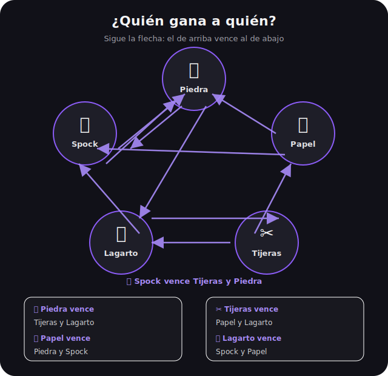

# 🖖 Rock Paper Scissors Lizard Spock

<p align="center">
  
</p>

<p align="center">
  <strong>Juego multijugador en tiempo real</strong> con chat integrado, modo vs CPU y PWA instalable.<br>
  Inspirado en <em>The Big Bang Theory</em> · Chat basado en <a href="https://github.com/NezbiT/Chat-node">Chat-node</a>
</p>

<p align="center">
  
  
  
  
  
</p>

---

## 📸 Vista previa

### Diagrama de reglas

Cada opción vence a **dos** otras. El juego incluye este diagrama interactivo en la web:

<p align="center">
  
</p>

| Opción | Vence a |
|--------|---------|
| 🪨 Piedra | ✂️ Tijeras, 🦎 Lagarto |
| 📄 Papel | 🪨 Piedra, 🖖 Spock |
| ✂️ Tijeras | 📄 Papel, 🦎 Lagarto |
| 🦎 Lagarto | 🖖 Spock, 📄 Papel |
| 🖖 Spock | ✂️ Tijeras, 🪨 Piedra |

### Icono PWA

<p align="center">
  
</p>

---

## ✨ Características

| Característica | Descripción |
|----------------|-------------|
| 🎮 **vs CPU** | Juega rondas contra la máquina con marcador acumulado |
| 👥 **Multijugador** | Emparejamiento automático en la misma red |
| 💬 **Chat** | Sala en tiempo real (módulo de Chat-node) |
| 📲 **PWA** | Instalable en móvil y escritorio, funciona offline (assets) |
| ⚡ **Ligero** | HTMX + un solo `game.js` — sin frameworks pesados |
| 🐍 **Consola** | Versión Python 3 para terminal |
| 🔧 **Diagnóstico** | Script `npm run diagnose` y logs del servidor |

---

## 🚀 Inicio rápido

### Requisitos

- [Node.js](https://nodejs.org/) 18 o superior
- [Python 3](https://www.python.org/) (solo para la versión consola)

### Instalación

```bash
git clone https://github.com/NezbiT/Rock_Paper_Scissors_Lizard_Spock.git
cd Rock_Paper_Scissors_Lizard_Spock
npm start
```

Abre **http://localhost:3000**, escribe tu nombre y pulsa **Entrar a la sala**.

### Jugar en red local (otra PC)

1. Inicia el servidor en la PC host: `npm start`
2. Copia la URL **Compartir** que aparece en consola (ej: `http://192.168.x.x:3000`)
3. En la otra PC, abre esa URL en el navegador
4. Cada jugador usa un **nombre distinto**
5. Si no conecta, ejecuta `open-firewall.bat` **como administrador** en la PC host

```bash
# Diagnóstico de conexión
npm run diagnose
npm run diagnose:lan
```

---

## ⚡ Vue 3 + Vercel (frontend) + Render (backend)

Arquitectura separada recomendada para producción:

```
┌─────────────────────┐         ┌──────────────────────────┐
│  Vue 3 en Vercel    │  wss    │  Node.js en Render/      │
│  client/            │ ──────► │  Railway (server/)       │
└─────────────────────┘         └──────────────────────────┘
```

### Desarrollo local (ambos a la vez)

```bash
# Terminal 1 — backend
npm start

# Terminal 2 — frontend Vue (proxy a :3000)
npm run dev:client
```

Abre **http://localhost:5173**

### Deploy backend → Render

1. [render.com](https://render.com) → **Web Service** → repo GitHub
2. **Root Directory:** *(raíz del repo)*
3. **Start Command:** `node server/index.js`
4. Variables de entorno:
   ```
   ALLOWED_ORIGINS=https://tu-app.vercel.app,http://localhost:5173
   ```
5. Copia la URL: `https://rpsls-xxxx.onrender.com`

### Deploy frontend → Vercel

1. [vercel.com](https://vercel.com) → **Import Project** → mismo repo
2. **Root Directory:** `client`
3. **Framework:** Vite
4. Variables de entorno:
   ```
   VITE_API_URL=https://rpsls-xxxx.onrender.com
   VITE_WS_URL=wss://rpsls-xxxx.onrender.com/ws
   ```
5. Deploy → URL tipo `https://rpsls.vercel.app`

> En Vercel el frontend es reactivo (Vue 3). El chat y multijugador viven en el backend.

---

## 🌐 Publicar el backend online (todo en uno)

Tu app necesita un servidor **Node.js con WebSocket**. Estas plataformas funcionan bien:

| Plataforma | Gratis | WebSocket | Dificultad |
|------------|--------|-----------|------------|
| **[Render](https://render.com)** | Sí (con límites) | ✅ | ⭐ Fácil |
| **[Railway](https://railway.app)** | Créditos gratis | ✅ | ⭐ Fácil |
| **[Fly.io](https://fly.io)** | Sí (con límites) | ✅ | ⭐⭐ Media |
| **VPS** (DigitalOcean, etc.) | No | ✅ | ⭐⭐⭐ |

### Opción A — Render (recomendada)

1. Crea cuenta en [render.com](https://render.com)
2. **New → Web Service** → conecta tu repo de GitHub
3. Configuración:
   - **Build Command:** *(dejar vacío)*
   - **Start Command:** `node server/index.js`
   - **Instance type:** Free
4. Deploy → te dará una URL como `https://rpsls-xxxx.onrender.com`
5. Comparte esa URL — funciona desde cualquier lugar del mundo

O usa el blueprint del repo: **New → Blueprint** (lee `render.yaml` automáticamente).

### Opción B — Railway

1. [railway.app](https://railway.app) → **New Project → Deploy from GitHub**
2. Selecciona `Rock_Paper_Scissors_Lizard_Spock`
3. Railway detecta `npm start` y despliega solo
4. **Settings → Networking → Generate Domain**

### Opción C — Docker (cualquier VPS)

```bash
docker build -t rpsls .
docker run -p 3000:3000 -e PORT=3000 rpsls
```

### No sirven para el backend

GitHub Pages, Netlify estático o hosting solo PHP — **no ejecutan Node ni WebSocket**.

> **Nota:** En plan gratis (Render/Railway) el servidor puede dormir tras inactividad. La primera visita tarda ~30 s en despertar.

---

## 📲 Instalar como app (PWA)

1. Abre el juego en **Chrome** o **Edge**
2. Busca el botón **Instalar app** o el ícono ⊕ en la barra de direcciones
3. La app queda en tu escritorio o pantalla de inicio

---

## 🎯 Modos de juego

```
┌─────────────────────────────────────────────────────────┐
│  LOGIN  →  Entrar a la sala  →  Elegir modo             │
│                                                         │
│   🤖 vs CPU          Juega contra la máquina            │
│   👥 Multijugador    Busca otro jugador en línea        │
│   💬 Chat            Habla con todos los conectados   │
└─────────────────────────────────────────────────────────┘
```

1. Entra con tu nombre
2. Elige **vs CPU** o **Multijugador**
3. Haz clic en tu jugada: 🪨 📄 ✂️ 🦎 🖖
4. Consulta las reglas con **Ver reglas** (modal con el diagrama)

---

## 🐍 Versión consola

```bash
python game.py
# o
npm run cli
```

Acepta números (`1`–`5`) o nombres (`rock`, `spock`, `piedra`…). Escribe `q` para salir.

---

## 🏗️ Arquitectura

```
Rock_Paper_Scissors_Lizard_Spock/
├── game.py                 # Juego en consola (Python 3)
├── open-firewall.bat       # Abre puerto 3000 en Windows
├── package.json
├── docs/
│   └── banner.svg          # Banner del README
├── public/
│   ├── index.html          # UI con HTMX
│   ├── manifest.webmanifest
│   ├── sw.js               # Service Worker (PWA)
│   ├── css/app.css
│   ├── js/game.js          # Cliente WebSocket (~200 líneas)
│   ├── images/rpsls-rules.svg
│   └── icons/
├── scripts/diagnose.js     # Test HTTP + WebSocket + JOIN
└── server/
    ├── index.js            # HTTP estático + API + partials HTMX
    ├── chatServer.js       # Chat (Chat-node)
    ├── gameServer.js       # CPU + multijugador
    ├── rpsls.js            # Reglas del juego
    ├── websocket.js        # WebSocket RFC 6455 sin npm
    └── logger.js
```

### Stack

| Capa | Tecnología |
|------|------------|
| Frontend | HTML, CSS, HTMX 2, JavaScript vanilla |
| Tiempo real | WebSocket propio (sin `socket.io`) |
| Backend | Node.js 18+ ESM |
| PWA | manifest + service worker |
| Consola | Python 3 |

### API

| Endpoint | Descripción |
|----------|-------------|
| `GET /api/info` | URLs local y de red |
| `GET /api/health` | Estado, jugadores en línea |
| `GET /partials/status` | Fragmento HTML para HTMX |
| `WS /ws` | Chat + juego (JSON) |

---

## 🛠️ Scripts

```bash
npm start          # Servidor en http://localhost:3000
npm run dev        # Servidor con auto-reload
npm run cli        # Juego en consola Python
npm run diagnose   # Diagnóstico localhost
npm run diagnose:lan  # Diagnóstico por IP de red
```

---

## 🤝 Multijugador — checklist

- [ ] Servidor corriendo (`npm start`)
- [ ] Ambas PCs en la **misma Wi-Fi**
- [ ] URL de red correcta (no `localhost` en la otra PC)
- [ ] Firewall abierto (`open-firewall.bat` como admin)
- [ ] Nombres **distintos** por jugador
- [ ] Recarga forzada **Ctrl+F5** si ves versión vieja

---

## 📜 Créditos

- **Autor:** [NezbiT](https://github.com/NezbiT) (Mario Alvarez)
- **Chat:** [Chat-node](https://github.com/NezbiT/Chat-node)
- **Reglas:** [Sam Kass — RPSSL](https://www.samkass.com/theories/RPSSL.html)
- **Pop culture:** The Big Bang Theory

## 📄 Licencia

MIT